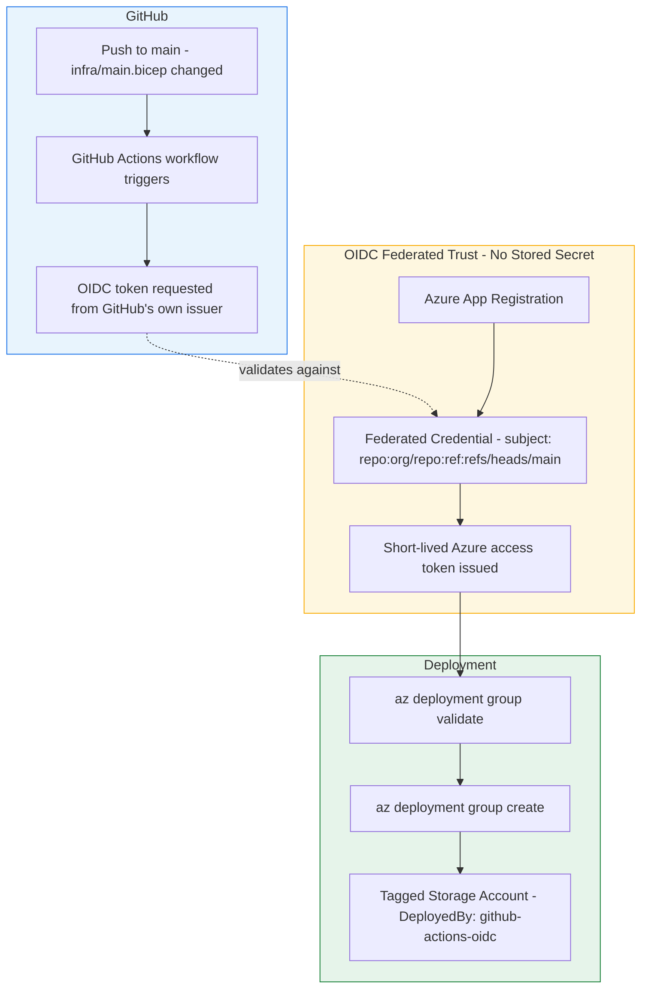

# Architecture Diagram

## Reading This Diagram

**GitHub (top, blue):** a push to main touching the infrastructure code
triggers the workflow, which requests a short-lived OIDC token from
GitHub's own token issuer.

**Trust (middle, amber):** the actual security mechanism. Azure's federated
credential is configured to trust tokens matching a very specific subject
claim - this exact repository, this exact branch.

**Deploy (bottom, green):** the pipeline validates the Bicep template before
attempting to apply it, then deploys.